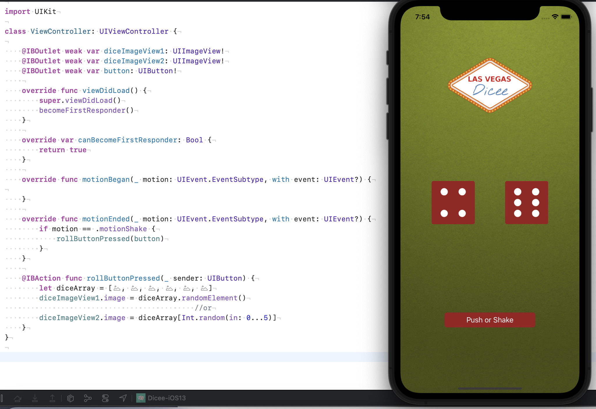

# DiceeApp

## Las Vegas dice app. 

- You can make the die roll at the press of a button or by shaking your phone. 
- With this app in your pocket, you’ll be fully set up to settle any score on the go!
___

```swift
// Shake gesture added!!!

import UIKit

class ViewController: UIViewController {

    @IBOutlet weak var diceImageView1: UIImageView!
    @IBOutlet weak var diceImageView2: UIImageView!
    @IBOutlet weak var button: UIButton!
    
    override func viewDidLoad() {
        super.viewDidLoad()
        becomeFirstResponder()
    }
    
    override var canBecomeFirstResponder: Bool {
        return true
    }
    
    override func motionBegan(_ motion: UIEvent.EventSubtype, with event: UIEvent?) {

    }
    
    override func motionEnded(_ motion: UIEvent.EventSubtype, with event: UIEvent?) {
        if motion == .motionShake {
            rollButtonPressed(button)
        }
    }
    
    @IBAction func rollButtonPressed(_ sender: UIButton) {
        let diceArray = [#imageLiteral(resourceName: "DiceOne"), #imageLiteral(resourceName: "DiceTwo"), #imageLiteral(resourceName: "DiceThree"), #imageLiteral(resourceName: "DiceFour"), #imageLiteral(resourceName: "DiceFive"), #imageLiteral(resourceName: "DiceSix")]
        diceImageView1.image = diceArray.randomElement()
                                            //or
        diceImageView2.image = diceArray[Int.random(in: 0...5)]
    }
}
```



